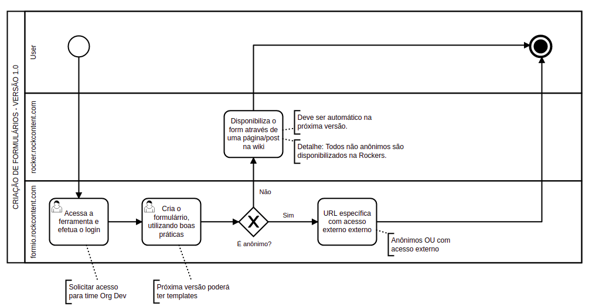

A simple doc with all what I did to run this project local and in a cloud.

Steps
-------------------
1) `git clone https://github.com/rockcontent/formio.git`

2) `npm install`

3) `npm start`

**Here, you will configure the project in the command line.**

 - Take a look at README.md and install all what you have to install.
 - The instalation will use the default mongo configuration as localhost. No password needed.
 - I choose the basic app configuration (option number 6)
 - Done! To run over localhost is done.

**If you will run over another address, go ahead and read the next steps:**

4) Change the file config/default.json and configure 'port', 'host' and 'domain' of your application. I didnt no change the mongo configuration.

5) Over AWS server, I did change **APP_URL** and **API_URL** in `./app/dist/config.js` file to 'https://forms.rockcontent.com'.

6) and **APP_URL** and **API_URL** in `./client/dist/config.js` to 'http://ec2-18-228-95-100.sa-east-1.compute.amazonaws.com:8081'. 

'Production' access
-------------------
https://forms.rockcontent.com

If you need/want to access the production env, please fill this form: https://rockers.rockcontent.com/wiki/forms-rockcontent-acesso/


How this version works
-------------------



General Notes
-------------------
 - AWS IP: 18.228.95.100
 - AWS URL: ec2-18-228-95-100.sa-east-1.compute.amazonaws.com

Using Linux, to access the AWS server over SSH you need to change the `rc-forms.pem` to 600. 

```
chmod rc-forms.pem 600
```

After this, you can access with something like 

```
ssh -i "~/rc-forms.pem" ubuntu@ec2-18-228-95-100.sa-east-1.compute.amazonaws.com
```
